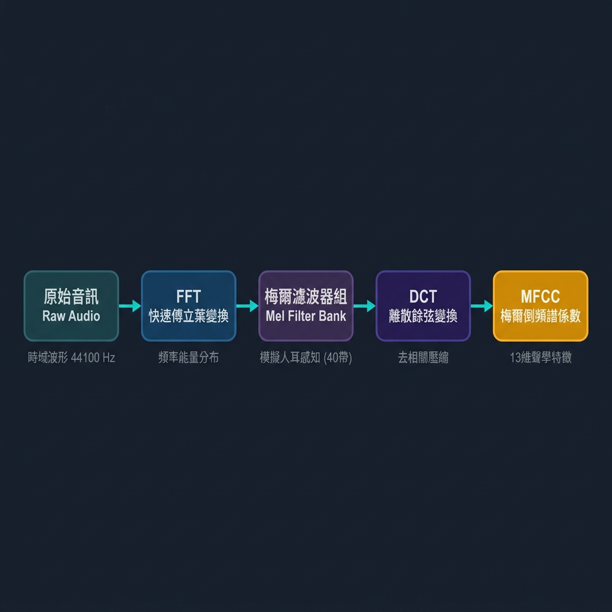

# 期中作業：音樂類型分類（Music Genre Classification）

## 專案簡介

使用 **GTZAN 資料集**，透過 **MFCC 音訊特徵提取** 搭配 **PyTorch MLP 神經網路**，
自動分類 10 種音樂類型。

| 項目 | 內容 |
|------|------|
| 資料集 | GTZAN（1000 首 × 30秒，10 類） |
| 特徵 | MFCC mean/std、Chroma、Spectral Contrast（共 59 維） |
| 模型 | MLP（256 → 128 → 64 → 10）+ BatchNorm + Dropout |
| 優化器 | Adam + StepLR Scheduler + Early Stopping（patience=20） |
| 預期準確率 | ~70–80% |

---

## MFCC 特徵提取流程



| 步驟 | 說明 |
|------|------|
| 原始音訊 | 時域波形，44100 Hz 取樣率 |
| FFT | 快速傅立葉變換，將時域轉換為頻域（功率頻譜） |
| 梅爾濾波器組 | 模擬人耳感知，將線性頻率壓縮為 40 個梅爾頻帶 |
| DCT | 離散餘弦變換，去除頻帶間相關性 |
| MFCC | 通常取前 13 個係數（視覺化），訓練時取 20 個以保留更多聲學資訊 |

---

## 資料集下載

1. 前往：https://www.kaggle.com/datasets/andradaolteanu/gtzan-dataset-music-genre-classification
2. 下載 `archive.zip`（約 1.2 GB）
3. 解壓後，把 `genres_original/` 資料夾放到 `Data/` 底下：

```
Midterm/
└── Data/
    └── genres_original/
        ├── blues/
        ├── classical/
        ├── country/
        ├── disco/
        ├── hiphop/
        ├── jazz/
        ├── metal/
        ├── pop/
        ├── reggae/
        └── rock/
```

---

## 執行步驟

### Step 1：提取特徵（約 5–10 分鐘）
```powershell
python extract_features.py
```
輸出：`features.csv`

### Step 2：訓練模型（約 1–2 分鐘）
```powershell
python train.py
```
輸出：`model.pth`、`training_curve.png`

### Step 3：評估與產生圖表
```powershell
python evaluate.py
```
輸出：
- `confusion_matrix.png`
- `mfcc_visualization.png`
- `genre_mfcc_comparison.png`
- 終端機顯示 Accuracy 與 F1-score

---

## 檔案說明

| 檔案 | 說明 |
|------|------|
| `extract_features.py` | 從 .wav 提取 MFCC 等特徵，存成 CSV |
| `train.py` | PyTorch MLP 訓練，含 Early Stopping，儲存最佳模型 |
| `evaluate.py` | 評估模型，產生混淆矩陣與視覺化圖表 |
| `features.csv` | 自動生成的特徵檔 |
| `model.pth` | 訓練好的模型權重 |

---

## 參考資料

- GTZAN Dataset: https://marsyas.info/downloads/data_sets.html
- Librosa 文件: https://librosa.org/doc/latest/index.html
- MFCC 原理: Davis & Mermelstein, 1980

---

## AI 協助聲明

本專案程式碼與文件撰寫過程中，使用 **Antigravity** 搭配 **Claude Sonnet 4.6**。
